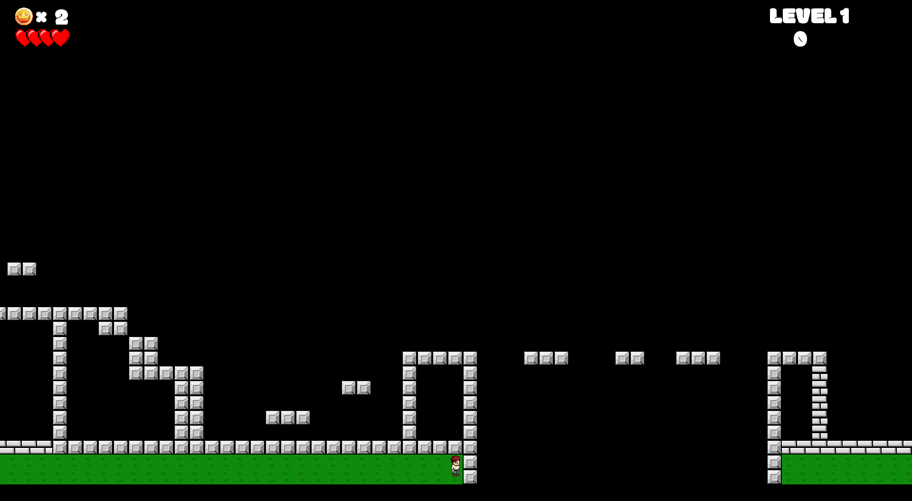

# Welcome to Pzero - Running Cha
Pzero is a gaming project inspired by Mario.
Running Cha: A Platform based Game like Mario made by Byamungu Kabiraba, Ali Todashev, Nicolas Anderson and Sultan Dzjumajev in SFML.
 Follow the instruction bellow to install the game on you machine.
 
# Game installation

```
TODO: Step-by-step instructions
```


# Instructions
Compile with JetBrains CLion

```
TODO: Step-by-step instructions
```

# 3rd-party libraries
* JsonCpp
* SFML


